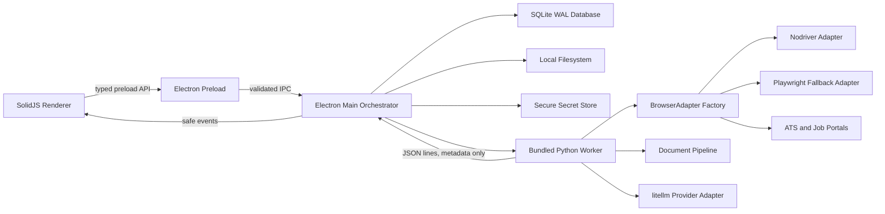
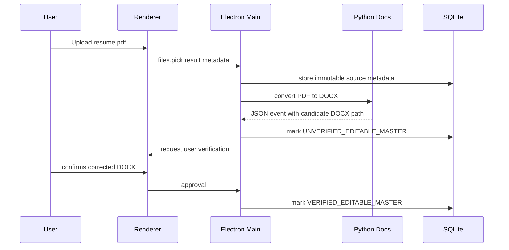
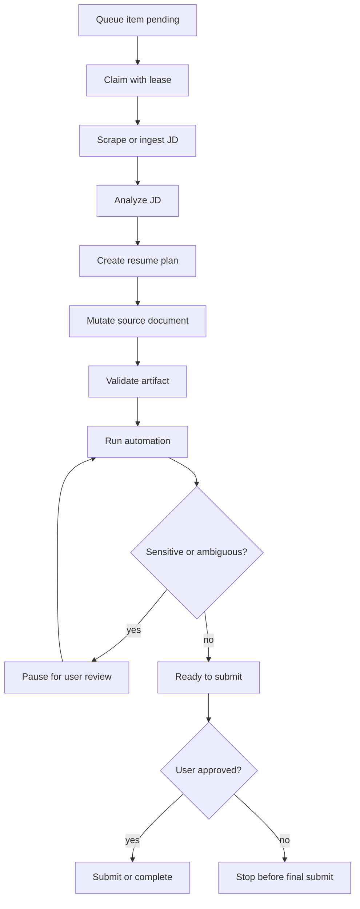

# Applyocalypse Architecture

## 1. Assumptions

- Applyocalypse is a desktop product with no required remote backend.
- The user brings provider keys. Python uses `litellm` to normalize OpenAI, Anthropic, Gemini, xAI, Groq, NVIDIA NIM, OpenRouter, Azure OpenAI, and AWS Bedrock.
- Python is bundled as a local executable for end users. During development it runs from the checked-in service package.
- SQLite is owned only by Electron Main. Renderer and Python workers never write SQLite.
- Generated resumes, cover letters, PDFs, screenshots, and browser artifacts live on disk. SQLite stores metadata only.
- Auto-submit is disabled by default and can only run when explicitly enabled and approved.

## 2. Architecture



Electron Main is the system authority. It owns migrations, queue claims, leases, heartbeats, process supervision, typed IPC, native theme state, local path normalization, and persistence.

The renderer is a control surface. It can request actions and subscribe to safe event streams, but it cannot access SQLite, raw filesystem APIs, child processes, or secrets.

Python workers are supervised executors. They scrape job pages, analyze descriptions, mutate documents, drive browser sessions, emit JSON events, and pause on uncertainty. They never write the database directly. Portal workflows now select deterministic browser adapter candidates: high-stealth boards stay on Nodriver, while lower-stealth ATS and government flows try Playwright first and fall back to Nodriver if the optional Playwright runtime is unavailable. Each workflow also carries expected runner steps and mandatory review checkpoints that are emitted to the Run Console before browser actions proceed. Workday, Greenhouse, Lever, Ashby, iCIMS, and Taleo also have explicit adapter plans with portal-specific step progression labels, material field hints, review gates, step caps, and final-submit labels.

Current implementation note: deterministic JD extraction is always available offline. If `LITELLM_MODEL` is present from a BYOK provider connection, Python attempts litellm-backed extraction and falls back to deterministic analysis without failing the run. Provider metadata can supply model, API base, Azure API version, AWS Bedrock region, and AWS access-key ID while the secret value remains OS-encrypted and is only decrypted inside Electron Main for worker launch. Portal detection now selects the declared browser adapter, with Nodriver as the default for unknown or stealth-sensitive portals and a real optional Playwright adapter for lower-stealth fallback flows.

## 3. Repository Structure

```text
applyocalypse/
  apps/desktop/
    src/main/       Electron orchestration, IPC, DB, scheduler, supervision
    src/preload/    strict contextBridge API
    src/renderer/   SolidJS application and GSAP motion
  packages/
    shared-types/   inferred TypeScript domain models
    shared-schemas/ Zod validation schemas
    ipc-contracts/  channel names and request/response contracts
    db/             migrations, SQLite connection, repositories
    validator/      deterministic writing and artifact checks
    config/         runtime constants
    logging/        redaction-safe logging helpers
    document-tools/ deterministic file naming and metadata helpers
    ui/             shared renderer primitives
  services/
    automation-python/ Python worker, browser adapters, docs, LLM, events
    parsers/           future parser service package
    jd-analysis/       future JD analysis service package
    tailoring/         future tailoring service package
  scripts/
    dev/
    build/
    migrations/
  docs/
  tests/
```

## 4. Database Schema

The initial migration creates:

- `app_settings`, `provider_connections`, `encrypted_secrets`
- `profiles`, `profile_snapshots`, `education_entries`, `experience_entries`, `project_entries`, `certification_entries`, `skill_groups`
- `uploaded_files`, `parsed_documents`
- `job_targets`, `job_descriptions`, `jd_keyword_sets`
- `tailoring_runs`, `generated_files`, `validation_reports`
- `application_runs`, `application_steps`, `application_answers`, `review_requests`, `approvals`
- `screenshots`, `browser_artifacts`, `queue_items`, `run_events`, `otp_sessions`, `audit_logs`

Enum strategy is SQLite `TEXT` plus `CHECK` constraints. Migrations are append-only SQL files. Soft deletion uses nullable `deleted_at` columns on user-owned or file-backed records.

Queue tables use WAL mode, transactions, `claimed_by`, `lease_expires_at`, and `heartbeat_at`. Restart recovery moves expired claimed work back to a safe recoverable state. If an application run lease expires while active or review-gated, recovery pauses both `application_runs` and the linked `queue_items` row and clears stale worker ownership so the user can inspect the interrupted job before resuming. Review-gated, blocked, and paused claimed queue items count against the local concurrency cap while a live worker is attached. The scheduler reads `automation.maxConcurrentApplications` from SQLite on each tick, defaults to `2`, and clamps it to the hard cap of `3` before claiming work.

## 5. IPC And Event Contracts

IPC contracts are explicit and validated with Zod. The preload API exposes narrow capabilities:

- `app.getVersion`
- `theme.getInitialState`, `theme.setPreference`, `theme.subscribe`
- `settings.get`, `settings.update`
- `profile.get`, `profile.getCanonical`, `profile.update`
- `documents.ingestResumeSource`, `documents.confirmEditableMaster`, `documents.listParsed`, `documents.repairEditableMasterAnchors`
- `files.pick`, `files.openLocalPath`, `files.listUploads`, `files.registerUpload`
- `jobs.enqueue`, `jobs.list`, `jobs.get`
- `runs.pause`, `runs.resume`, `runs.cancel`, `runs.retryStep`, `runs.approve`, `runs.reject`
- `logs.subscribe`
- `screenshots.list`
- `folders.openDownloads`, `folders.chooseOutputDir`

Python emits newline-delimited JSON. Every event includes `event_type`, `run_id`, `step_id`, `timestamp`, `severity`, `message`, `machine_state`, `ui_state`, and `payload`. Screenshot and browser-artifact payloads contain metadata only. DOM snapshots are saved as run-scoped JSON files and persisted through `browser_artifacts`; raw DOM data does not cross IPC.

Generated document events also carry metadata only. Main validates that generated paths are absolute and exist, then stores filename, path, hash, size, format, upload status, retention policy, and deletion timestamps in `generated_files`. Browser `FILE_UPLOADED` events mark matching generated-file metadata as uploaded without storing file bytes. Deterministic validation reports are persisted in `validation_reports`; document bytes never enter SQLite.

Local file rendering through the custom `applyocalypse://artifact` protocol is DB-known artifact only. Screenshots, generated files, uploaded source custody paths, and browser artifacts must already exist in SQLite before the renderer can load them; arbitrary Downloads, temp, or userData paths are not granted by root alone. `files.openLocalPath` follows the same principle, with one additional allowance for paths selected through the native file picker during the current session.

Packaged desktop smoke verifies more than process startup: the command center must render, native theme state must be present on `documentElement`, and the contextBridge preload API must expose the expected narrow surface. A second packaged user-flow smoke disables the scheduler and exercises a local-first preload flow: theme preference update, starter profile creation, job enqueue, queue persistence, and renderer isolation from Node primitives. A full-flow packaged smoke runs the app twice against the same isolated `userData` directory and verifies onboarding, source-material ingestion, parser persistence, queue persistence after restart, and renderer isolation. The preload bundle is emitted as CommonJS because Electron sandbox preload scripts cannot execute ESM import syntax.

Final submit uses a separate event path from ordinary portal navigation. Safe portal entry clicks explicitly reject submit-like labels. After the renderer records a `FINAL_SUBMIT` approval, the live worker may click only exact final-submit controls and emits `SUBMITTED` only when post-click confirmation text is detected. If confirmation cannot be verified, the run pauses instead of claiming success.

Multi-page ATS progression is intentionally conservative. After reviewed answers and uploads are applied on the current page, Python may click only known non-final progression controls such as Next, Continue, Save and continue, or Review application. It then rechecks blockers, observes portal state, redetects fields, and repeats the answer/upload review loop. Ambiguous progression controls create a `PORTAL_STEP` review request with sanitized candidate labels, and automation stops after six reviewed progression steps to avoid uncontrolled loops.

The apply phase emits screenshot timeline metadata when the active browser adapter supports screenshots. Screenshots are saved under the run work directory after the application page is reopened, after reviewed fields/uploads are applied, and after each safe portal progression step. Only metadata and hashes cross stdout and IPC. Electron Main validates that the screenshot path is inside an approved artifact root, verifies the emitted SHA-256 when present, computes one when absent, and upserts by `(application_run_id, screenshot_id)` so retried deterministic captures do not duplicate timeline entries. Browser adapters read PNG dimensions from the written file instead of reporting hardcoded viewport metadata when possible.

Run controls are live-worker aware. Resume, retry, skip, review-resolution, and approval commands are rejected with an audit event if the supervised Python worker is no longer active. Unsupported retry/skip commands received while a manual gate requires resume-or-cancel emit `USER_REVIEW_REQUIRED` feedback instead of disappearing. Unexpected worker exits immediately pause the run, clear queue leases, persist a `PAUSED` diagnostic event, and broadcast the issue to the renderer.

Field filling is an explicit answer-review gate. The browser worker emits detected fields and proposed values, Electron Main persists them in `application_answers`, and `FIELD_REVIEW_REQUIRED` pauses create `ANSWER` review requests. The renderer IPC surface may only mark answers as `EDITED` or `REJECTED`; it cannot directly mark an answer `APPROVED` or `APPLIED`. Promotion to `APPROVED` happens only inside Electron Main's explicit approval workflow, which records an approval decision, resolves the matching review request, and sends the bounded approved-answer payload to Python. Main sends only answers marked `APPROVED` back to Python; required fields without approved answers pause the same live worker before any fill or final-submit attempt. Runtime polling peeks at unrelated `RESUME` controls so a later document or final-submit approval cannot be consumed by an earlier non-gate step.

Login and account-creation pages are treated as user-action blockers rather than automation failures. Python emits a safe pause reason, Main persists a `LOGIN` review request, and the renderer instructs the user to sign in manually before resuming the same run state. Browser blocker detection also pauses on sensitive or ambiguous application questions such as work authorization, sponsorship, clearance, compensation, relocation, and voluntary EEO fields before any value is applied.

Portal entry actions are also reviewable. If a known portal workflow has Apply/Start labels but the worker cannot click one safely, or if multiple safe-looking entry controls match, Python emits `PORTAL_ENTRY_ACTION_REQUIRED`, Main persists a `PORTAL_ENTRY` review request, and the renderer asks the user to click the portal action manually before resuming. Ambiguous click events expose sanitized candidate labels only. This prevents downstream field detection and filling from running on a job description page, search results page, or other wrong surface.

US and India job boards from the target list are represented in the portal registry and now carry conservative entry-action labels when known. The DOM click helper refuses final-submit-like labels even when an entry-action list is present, and portal page-state classification still requires redirect evidence, a known ATS/application surface, or enough form fields before automation proceeds.

The same portal classification and safe-click policy is now exercised by replayable HTML fixtures for representative Workday, Greenhouse, Lever, Ashby, iCIMS, and Taleo application pages plus representative US and India job-board listing states. This gives deterministic coverage for page-state detection, field mapping, blocker detection, redirect-review requirements, and final-submit refusal without relying on live portal availability during local tests.

After portal entry, Python emits `PORTAL_STATE_OBSERVED` with safe metadata only: original URL, current URL, detected portal, host/portal change flags, field count, application-surface confidence, and explanatory signals. For job-board flows that require redirect watching, lack of redirect plus weak application-surface evidence emits `PORTAL_REDIRECT_REVIEW_REQUIRED`, which resolves through the same `PORTAL_ENTRY` manual review path.

Portal workflow metadata is part of the observable control contract. `PORTAL_WORKFLOW_SELECTED` and pre-browser `JD_SCRAPE_STARTED` payloads include `expected_steps` and `review_checkpoints`; the renderer summarizes these counts and shows the first planned steps/checkpoints so the user can compare automation behavior against the declared plan.

Cover-letter requirements are detected in two places: JD analysis before tailoring, and observed application-form fields during browser automation. A required cover-letter upload without a matching generated or reviewed local artifact emits a document review request and pauses the live worker before `READY_TO_SUBMIT`, so missing application material cannot be skipped silently. After the user provides or manually uploads the document, the same worker reads the refreshed approval payload, redetects fields, and retries upload handling.

When the user approves a document review, Electron Main sends Python a bounded list of upload-eligible artifacts: generated files for the run plus reviewed `COVER_LETTER` uploads attached to the run profile. Supporting-detail uploads, source resumes, and arbitrary picked paths are not exposed to automation. If the user handles a required upload manually in the browser, Python detects the file input count and records a manual upload event without reading or transmitting file bytes.

## 6. Parsing And Document Strategy

PDF is ingestion-only. The app stores the original PDF, converts it locally with `pdf2docx`, marks the DOCX as `UNVERIFIED_EDITABLE_MASTER`, and requires user verification before tailoring.

All uploaded source materials pass through the supervised parser boundary. Electron Main first copies picked source files into Applyocalypse-managed local custody, then registers the custody path in SQLite; this keeps parsing, PDF conversion, editable-master confirmation, and later automation stable even if the original picked file is moved or deleted. The local parser detects common section headings and extracts structured identity, education, experience, project, certification, and skill facts from TXT/MD/TEX and DOCX-derived text before any LLM is involved. DOCX text extraction reads top-level paragraphs, table-cell paragraphs, and safe row context so table-based resume layouts do not hide section headings. Resume DOCX/TEX sources and supporting-detail files can conservatively merge high-confidence structured facts into the canonical profile. The merge path is append-only for structured entries: explicit existing entries win, duplicate parsed entries are skipped, and low-confidence parsed entries are surfaced for review instead of merged. Cover-letter samples are parsed and persisted as evidence, but they do not silently change profile facts. Parser output is stored in `parsed_documents` with confidence, warnings, style maps, and anchor maps.

DOCX is first-class. The parser builds a canonical content map with paragraph, run, style, section, table, bullet, numbering, and anchor metadata. Verified masters receive deterministic bookmarks or hidden markers for later targeted mutation. The implemented safe mutation path only replaces explicit Applyocalypse placeholders such as `{{APPLYO_RESUME_SUMMARY}}` and `{{APPLYO_SKILLS}}`; if anchors are absent, the worker asks for review instead of guessing. Placeholder mutation traverses top-level paragraphs and DOCX table cells while preserving existing run structure. After DOCX mutation, the worker attempts local PDF export through LibreOffice or Word/docx2pdf when available and emits a reviewable validation warning when no local exporter exists.

TEX is first-class. The parser treats TEX as source code, prefers TexSoup-style structure inspection, identifies sections and item blocks, mutates only targeted regions, and compiles tailored output with Tectonic. The implemented TEX mutation path likewise uses explicit placeholders for safe automated edits. If Tectonic is unavailable or compilation fails, the worker keeps the tailored TEX artifact and emits a validation event requiring user review instead of claiming a PDF exists.

Parser output now separates structural anchors from explicit mutation placeholders. The renderer shows both counts in the Documents panel so users can distinguish "the parser understands this file" from "the file is safe for deterministic mutation." Missing placeholders are surfaced as anchor-repair warnings. For DOCX/TEX resume sources, Electron Main can ask the Python document service to create a new unverified anchored candidate. This repair path never edits the original source and remains conservative: DOCX repair targets likely name, summary, and skills regions across top-level paragraphs and table cells, while TEX repair targets section bodies and warns when name macros are not safe to modify automatically.

The renderer now builds a compact visual anchor-repair model for editable masters. It ranks ready, repairable, and review-only zones from parsed section metadata and known Applyocalypse placeholders, then shows the user which regions are safe candidates before generating a new anchored master candidate.

When no safe editable-master mutation is available, the worker writes local Markdown review artifacts and pauses. That fallback is intentionally a review artifact, not a replacement for the primary format-preserving DOCX/TEX path. The fallback renderer now consumes the tailoring plan, so verified matching evidence affects section ordering, skill priority, and bullet limits while unsupported missing keywords remain outside generated claims.

## 7. Core Workflows

### PDF Editable Master



### Application Run



## 8. Implementation Plan

1. Foundation: contracts, schema, theme, queue, and event protocol.
2. Desktop shell: secure Electron window, preload bridge, Solid control center skeleton.
3. Data layer: migrations, repositories, scheduler, restart recovery.
4. Document pipeline: PDF conversion, DOCX anchors, TEX parser and compiler.
5. Analysis and tailoring: JD analysis, truthful evidence matching, validation.
6. Automation: Nodriver adapter, portal adapters, screenshots, checkpoints.
7. Control center: live console, answer edits, approvals, retry, skip, diagnostics.
8. Packaging: PyInstaller binary, electron-builder hooks, signing in the packaging phase.

Implemented controls now include pause/resume/cancel/retry/skip control files, persisted and capped automation concurrency, deterministic browser adapter fallback, ATS-specific adapter plans, live-worker-aware control rejection, document review requests, answer review requests, sensitive-question blocking, typed approval metadata, final submit gating, login blocker review, portal-entry review, portal page-state observations, replayable ATS fixture coverage, opt-in live portal certification reports, BYOK provider matrix reporting, form-based cover-letter requirement detection, generated artifact listing, screenshot metadata ingestion, DOM artifact persistence, approved-answer-only text filling, conservative generated-file upload, parser confidence display, editable-master anchor diagnostics and repair candidates, queue lease recovery, scheduler preparation failure isolation, provider-secret failure pausing, packaged preload user-flow smoke, packaged full-flow restart smoke, release preflight reporting, and retention cleanup for expired generated files.

## 9. Known Risks

- Nodriver is younger than Playwright. The Python `BrowserAdapter` interface isolates this risk and allows portal-specific Playwright fallback later.
- DOCX files vary heavily. Anchoring must be reviewed and confirmed before the product promises stable mutation.
- PDF conversion is best-effort. The user must verify the generated editable master.
- ATS portals change often. Portal adapters need diagnostics, screenshots, and safe pauses instead of brittle blind execution.
- Login flows vary by portal and identity provider. The current safe behavior is manual user login with resume, not automated credential entry.
- Portal entry actions vary by locale, A/B test, and authenticated state. Missed entry actions now pause safely, but each portal still needs deeper page-state adapters before production auto-fill can be considered complete.
- Packaging verifies that the PyInstaller worker and manifest are present in Electron resources. The `afterPack` hook can sign the worker executable and every DLL and extension module beside it on Windows via `signtool` (`WINDOWS_SIGNTOOL_PATH`, `WINDOWS_CERT_SHA1`, optional `WINDOWS_TIMESTAMP_URL`) or on macOS via `codesign` (`APPLE_CODESIGN_IDENTITY`). Setting `APPLYO_REQUIRE_CODE_SIGNING=1` turns missing signing configuration into a release-blocking error.
- Live certification and BYOK provider checks are intentionally opt-in. Without operator-supplied portal URLs, test identities, provider keys, and signing identities, the release preflight reports blocked gates rather than claiming production readiness.
